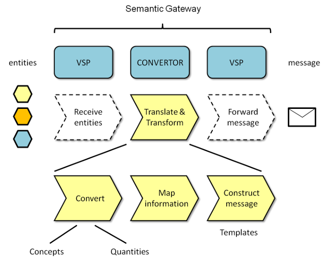
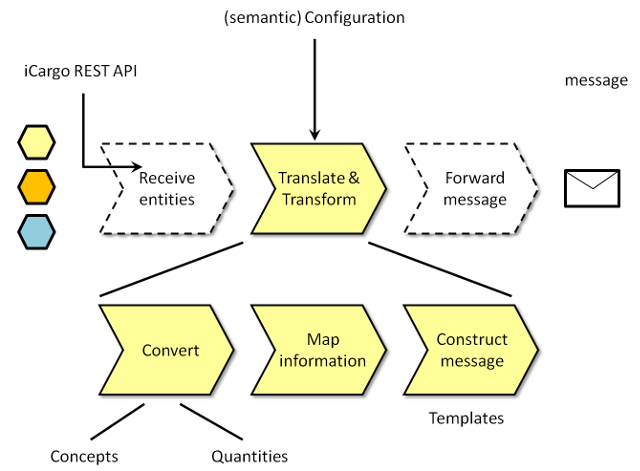

# Semantic Gateways - an introduction

The main objective of a Semantic Gateway is to translate and transform data into information for the recipient which is either a receiving Access Point of the same organisation or an participating (other) organisation. 

## Cargo message structure

#### iCargo message structure

## Deployment

#### Integrated solution

A Semantic Gateway require several software components which are also required for an Access Point. Therefore, it makes sense to combine the implementation of an Access Point and a Semantic Gateway. 

#### Stand-alone solution

If security policies require a stand-alone Semantic Gateway then  the Access Point can be deployed as a separate software service within the same execution environment or within an external execution environment. 

#### Interfacing with legacy systems

For interaction with legacy systems or non-iCargo compliant software services in general, software adapters are required for protocol conversions. The figure below gives a few examples of adapters.

## Software components

A Semantic Gateway service contains two software components: the operational online service for conversion and an offline application to configuration.

## Inbound process

#### Online conversion service

The Semantic Gateway as designed in the iCargo project consists of two types of software modules: a Virtual Service Point (VSP) and a Convertor.
  

A Virtual Service Point is able to check incoming requests, to validated if the originator of the request is known and authorised. If so, the Virtual Service Point will direct the incoming message to a specific convertor. Once the incoming request is processed, the result is forwarded by a Virtual Service Point to an Access Point.

The design looks symmetric but the reverse operation to convert entities into messages is functional different. Incoming messages need to be decomposed into smaller information elements while the reverse process requires a composition of a message out of smaller information elements. 
 
#### SG inbound 3

#### SG inbound 4

## The Semantic Gateway in reverse

#### SG outbound 0

## Outbound process

#### SG outbound 1

#### SG outbound 2

#### SG outbound 3

#### SG outbound 4

## Offline configuration application

