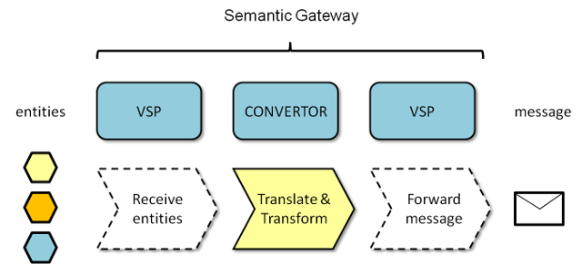

# Semantic Gateways - an introduction

## Cargo message structure

## Software components

A Semantic Gateway service contains two software components: the operational online service for conversion and an offline application to configuration.

## Inbound process

#### Online conversion service

The Semantic Gateway as designed in the iCargo project consists of two types of software modules: a Virtual Service Point (VSP) and a Convertor.
  

A Virtual Service Point is able to check incoming requests, to validated if the originator of the request is known and authorised. If so, the Virtual Service Point will direct the incoming message to a specific convertor. Once the incoming request is processed, the result is forwarded by a Virtual Service Point to an Access Point.

The design looks symmetric but the reverse operation to convert entities into messages is functional different. Incoming messages need to be decomposed into smaller information elements while the reverse process requires a composition of a message out of smaller information elements. 
 
#### SG inbound 3

#### SG inbound 4

## The Semantic Gateway in reverse

#### SG outbound 0

## Outbound process

#### SG outbound 1

#### SG outbound 2

#### SG outbound 3

#### SG outbound 4

## Offline configuration application

